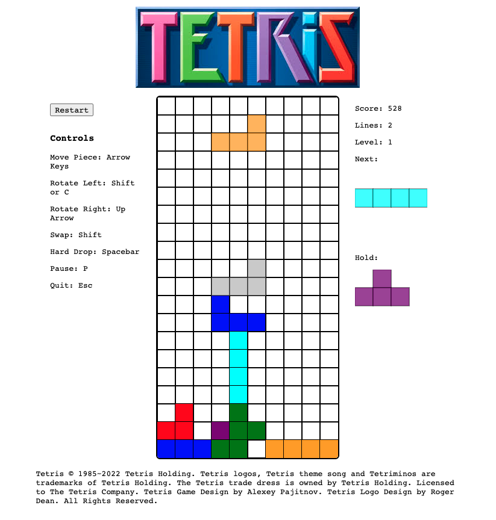

<h1>Welcome to My Tetris</h1>

<h2>Task:</h2>

The challenge is to recreate the classic game Tetris. The goal is to handle all of the game logic simultaneously while rendering it smoothly on the screen.

<h2>Description:</h2>

I used JavaScript to code the game, leveraging its capabilities in DOM management, event handling, and rendering using the canvas element.

<h2>Installation:</h2>

To run the program, you can either clone the repository and open it in your browser, or play it at <a href='tetris-gules.vercel.app'>tetris-gules.vercel.app</a>.

<h2>Usage:</h2>

The game works by setting the state of the board and continuously calling the animate function. When the state changes due to user interaction, the board is redrawn to create the illusion of fluid, dynamic movement.

<h2>The Core Team:</h2>

This game was developed at Qwasar SV - Software Engineering School 

